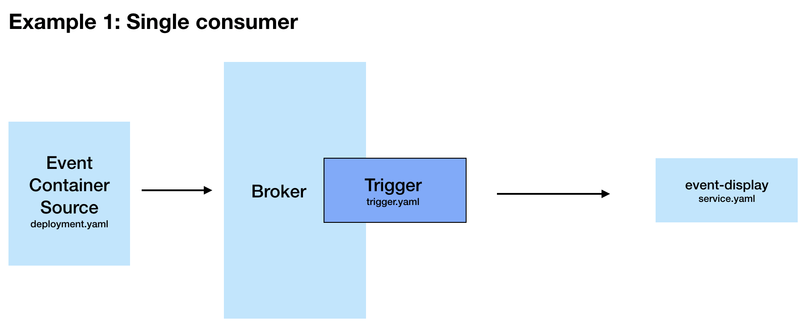
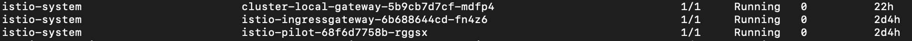
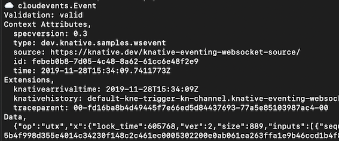

# Knative Eventing Demo
This project explores Knative Eventing. The aim of the project is to deploy a go application that streams messages to a Knative broker, where a service (event display) can subscribe to the events. The message stream data is from the blockchain.info WebSocket API and sends information about new bitcoin transactions in real-time. You can find more information about this service at the link below:

https://www.blockchain.com/api/api_websocket

This demo will be built out over time to include multiple consumer services, however for now we will have one source, a broker, trigger and one consumer/subscriber. In the case where you only have one consumer/subscriber, you can sink straight to there (in this case that would be the event-display service). However, as it is the hope that this tutorial will be extended to include multiple, the broker and trigger will be used.

Below is a diagram of this initial version:



In order to run this demo, you will need:

- A Kubernetes cluster (a single node cluster running on Docker desktop is fine and is used to build this example)
- kubectl
- Istio installed (instructions below)
- Knative installed (inctructions below)

## Installing Istio

To install Istio, I am currently following the instructions below:

https://knative.dev/docs/install/installing-istio/

Then run the following command in order to enable Istio in the default (or alternative) namespace:

```kubectl label namespace <namespace> istio-injection=enabled```

I spent a long time struggling to get my events to actually end up at the event-display. Finally, after reading [this](https://medium.com/google-cloud/cluster-local-issue-with-knative-eventing-v0-9-0-a1fee2215cfe) great blogpost, I realised that I needed to add the cluster local gateway to my Istio installation. It is necessary if you want to be able to have Knative services as sinks. This is not installed as standard in the Knative instructions but is mentioned [here](https://knative.dev/docs/install/installing-istio/#updating-your-install-to-use-cluster-local-gateway).

Running ```kubectl get pods -n istio-system``` should give these:




## Installing Knative 

Run the install_knative.sh script to install the Knative components. This will do a complete install of Knative Serving, Eventing and Monitoring. For a lighter install, you can follow the below instructions for Docker Desktop:

https://knative.dev/docs/install/knative-with-docker-for-mac/


To confirm your install is complete, you can run the following command:

```kubectl get pods --all-namespaces```

You should have namespaces for ```istio-system```, ```knative-eventing```, ```knative-serving``` (and ```knative-monitoring``` if you have installed using the install script).

## Building the Docker image

There is already a Docker image available for this tutorial, however if you want to make your own then you could make your own image for your own go application. 

To build a Docker image you will need to ensure you have a Dockerfile (there is one in this repo, which I used for building the image we deploy) and then from the directory where it is located, you can run the following commands (ensure you are also logged into your image repo account e.g Dockerhub):

example to build:

```docker build -t josiemundi/wseventsourceimage .```

example to push: 

```docker push josiemundi/wseventsourceimage```

## Run the yaml scripts

There are 4 main yaml scripts that need to be run to get this tutorial working. 

### Set up namespace and verify broker is ready

First ```kubectl apply -f 001-namespace.yaml``` This will deploy the knative-eventing-websocket-source namespace and enable the knative-eventing injection. 

Verify that the default broker is ready by running ```kubectl get broker -n <namespace>``` and you should see that the default broker has a status of READY=True. 

### Deploy application, trigger and event-display service

Run the following:

```kubectl apply -f 010-deployment.yaml``` This deploys the application as a Kubernetes app deployment. It declares the sink as the default broker within the relevant namespace. 

```kubectl apply - 040-trigger.yaml``` This is our trigger, which is where we specify which services would like to subscribe to which type of events. 

```kubectl apply - 030-service.yaml``` This is our Knative serving service deployment, which will subscribe to the events coming from our application and display them. 

## Verifying messages:

You can use the following kubectl commands to verify the process at each stage. 

to see logs of app:

```kubectl --namespace knative-eventing-websocket-source logs -l app=wseventsource --tail=100```

to see logs of broker:

```kubectl --namespace knative-eventing-websocket-source logs -l eventing.knative.dev/broker=default --tail=100```

to see logs of services:

```kubectl logs -l serving.knative.dev/service=event-display -c user-container --tail==100 -n knative-eventing-websocket-source```

For the event-display logs, you should see something like:




 
